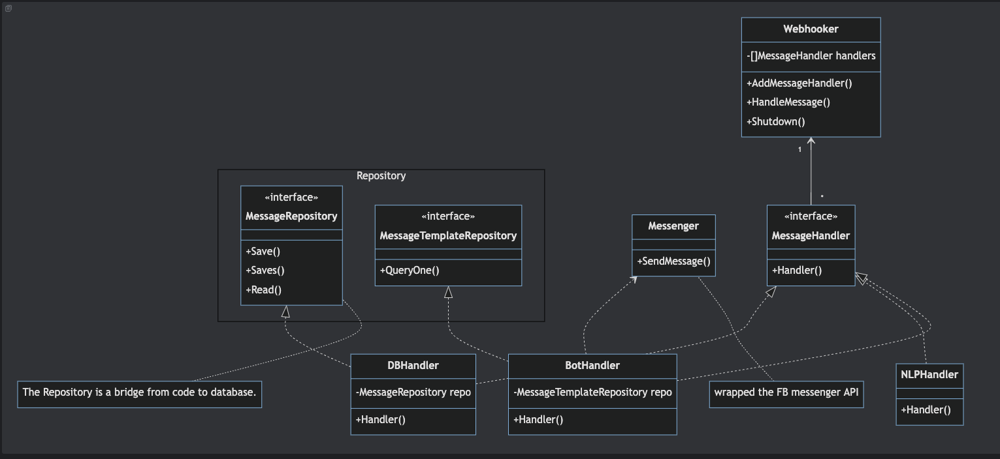

# messageBot

This is a bot for receive message from facebook messenger.

### Architecture

### Sequence

### More

If we have powerful computer (8H16G + GPU)，We can use the [LocalAI](https://localai.io/) to run nlp model in local.
Now it will ask huggingface.io for help. 